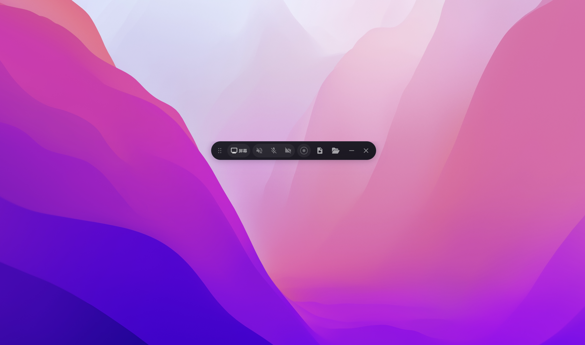
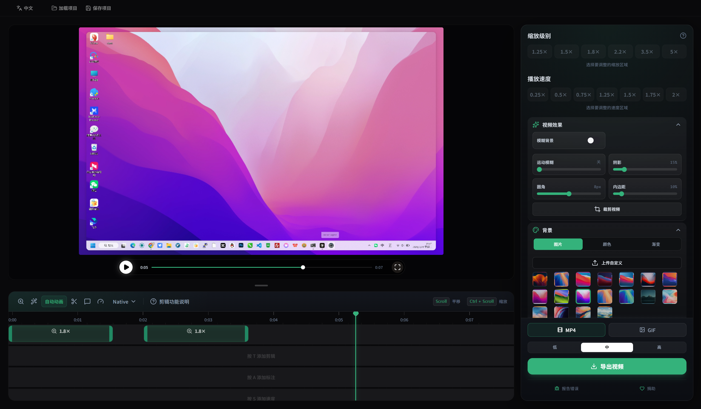

<div align="center">


# 小骆录屏 · OpenScreen 简体中文增强版

**免费、开源、无水印的屏幕录制与编辑工具**  
面向中文用户深度优化，录屏、剪辑、导出一站完成。

<p>
  <a href="https://github.com/itohok/openscreen-zh-cn/stargazers"></a>
  <a href="https://github.com/itohok/openscreen-zh-cn/network/members"></a>
  <a href="https://github.com/itohok/openscreen-zh-cn/issues"></a>
  <a href="./LICENSE"></a>
</p>

<p>
  <a href="https://github.com/itohok/openscreen-zh-cn/releases">⬇️ 下载最新版</a> ·
  <a href="https://github.com/itohok/openscreen-zh-cn/issues">🐞 提交问题</a> ·
  <a href="https://github.com/itohok/openscreen-zh-cn/issues/new/choose">💡 功能建议</a>
</p>

</div>

---

## ✨ 为什么选择小骆录屏

- 🌏 **完整简体中文体验**：关键界面与交互文案全面中文化
- 🎬 **录制 + 编辑一体化**：录完就能剪，避免多工具切换
- ⚡ **轻量高效**：开箱即用，适合产品演示、课程录制、工作汇报
- 🆓 **免费无水印**：个人与商业场景均可使用（遵循开源协议）

---

## 🧩 核心功能

- 录制整个屏幕或指定窗口
- 麦克风 / 系统音频录制控制
- 自动缩放与手动缩放（可调节深度）
- 裁剪、标注（文字/箭头/图片）、速度调节
- 自定义背景（壁纸 / 纯色 / 渐变 / 自定义）
- 多比例导出，适配主流内容平台

---

## 📊 功能对比（快速了解）

| 能力 | 小骆录屏（本项目） | 原始 OpenScreen | 说明 |
|---|---|---|---|
| 简体中文界面 | ✅ 深度优化 | ⚠️ 部分/原始语言 | 本项目重点增强方向 |
| 屏幕录制 | ✅ | ✅ | 支持常见录制场景 |
| 录后编辑 | ✅ | ✅ | 裁剪/标注/速度/缩放 |
| 免费无水印 | ✅ | ✅ | 开源免费 |
| 本地化交互优化 | ✅ | ⚠️ | 持续迭代中 |

> 说明：本项目是基于上游仓库的中文增强分支，会持续同步上游优秀改动。

---

## 🖼️ 软件截图

<p align="center">
  
  
</p>

---

## 📦 下载与安装

请前往 [Releases](https://github.com/itohok/openscreen-zh-cn/releases) 下载。

### Windows

- 下载 `小骆录屏-Win-x64-xxx.zip` 或安装包
- 解压后运行 `小骆录屏.exe`

> 若首次运行出现安全提示，请选择“仍要运行”。

### macOS

建议在 macOS 设备上自行构建，或下载后按系统提示授予录屏/麦克风权限。

### Linux

下载对应 AppImage 后授予可执行权限运行。

---

## 🚀 本地开发

### 环境要求

- Node.js 22.x
- npm 10.x

### 安装依赖

```bash
npm install
```

### 开发运行

```bash
npm run dev
```

### 构建

```bash
npm run build-vite
```

### Windows 打包

```bash
npx electron-builder --win nsis portable
```

---

## 🗂️ 更新日志（模板）

> 发布新版本时建议按下列结构填写 Release：

### `v1.2.1-zh-cn.1`（示例）

- ✅ 新增：简体中文文案补全与交互细节优化
- 🛠 修复：录制流程与快捷键相关问题
- 🎨 优化：应用图标与打包体验
- 📦 发布：Windows x64 版本

---

## 🤝 如何贡献

欢迎 Issue / PR：

1. Fork 本仓库
2. 创建分支：`feat/xxx` 或 `fix/xxx`
3. 提交代码并推送
4. 发起 Pull Request

---

## 🙏 致谢

本项目基于：

- [siddharthvaddem/openscreen](https://github.com/siddharthvaddem/openscreen)

感谢原作者与社区贡献者的优秀工作。

---

## 📄 License

本项目遵循 [MIT License](./LICENSE)。
